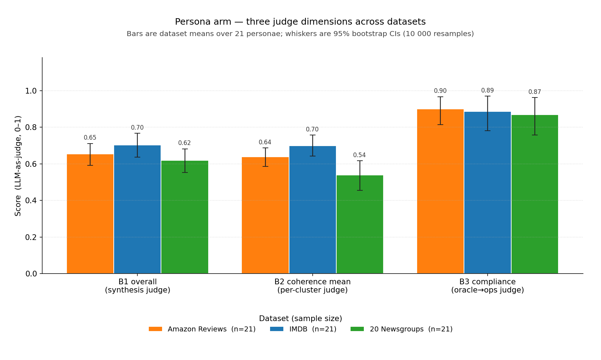
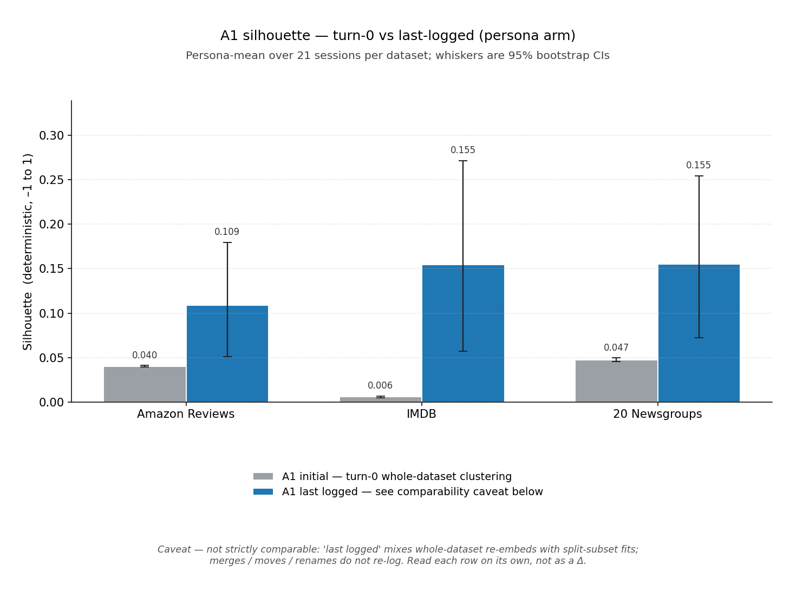
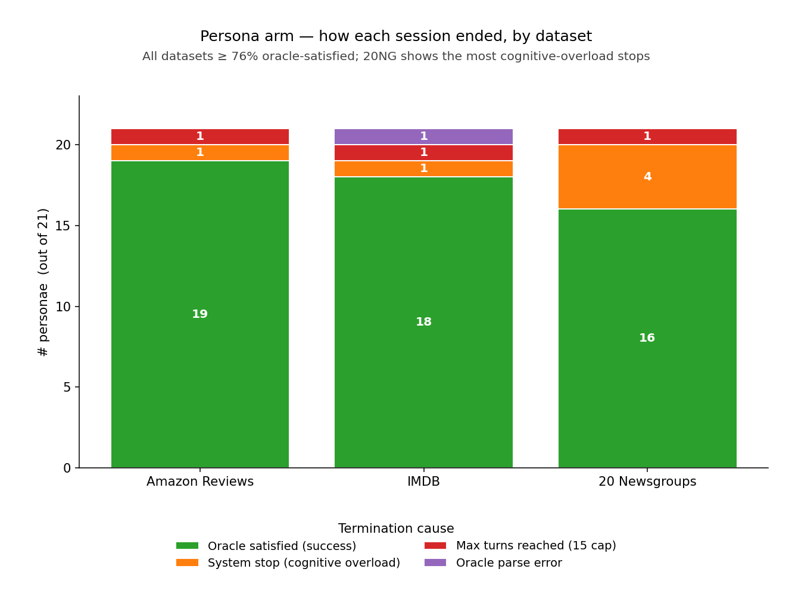
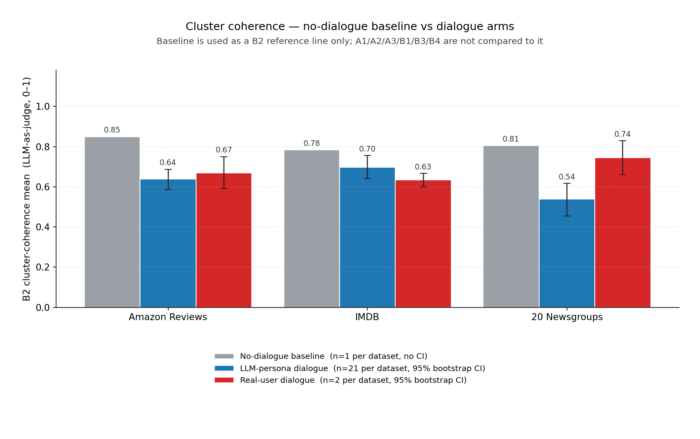
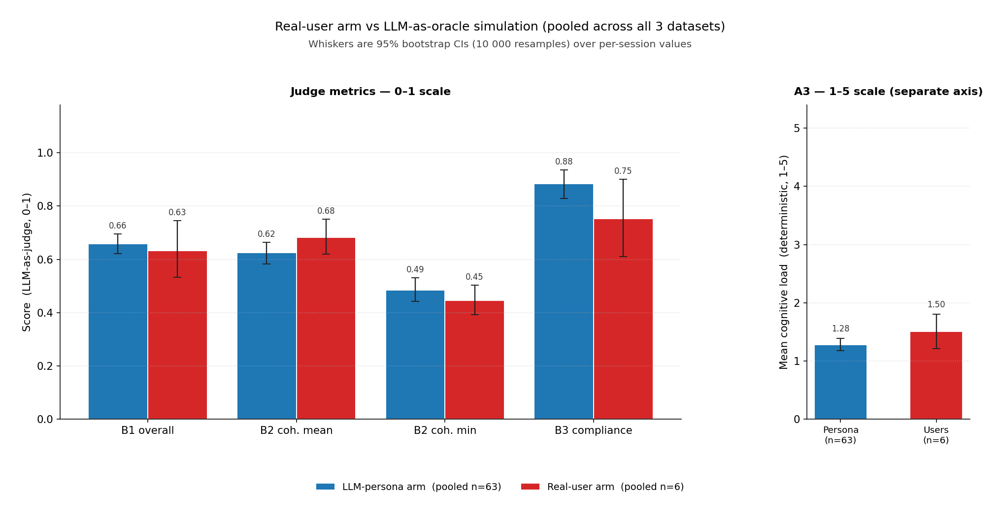
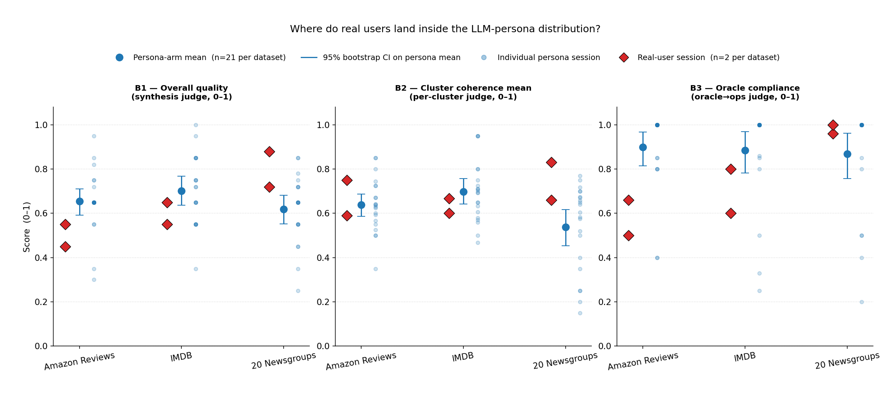

# BlaBlaClust — Final Experimental Report

_Generated 2026-06-05. Code version: Sprint 4 (post oracle-pinning fix). Judge model: google/gemini-3.1-flash-lite. Persona max turns: 15. Persona runs dated 2026-06-04; baseline + real-user runs dated 2026-06-04 / 2026-06-05._

## 1. Quality specification (pre-committed)

Quality in this system is **multi-dimensional**. Per the project specs (§10), we name the dimensions, the operationalization, and the measurement method up front. No single dimension is collapsed into a scalar verdict; every quantitative claim is reported with a percentile-bootstrap 95% confidence interval (10 000 resamples over per-session values), with the explicit exceptions noted below.

| Dimension | Metric (code label) | Operationalization | Measurement | CI reported? |
|---|---|---|---|---|
| Geometric cluster quality | A1 silhouette (initial / last logged) | sklearn silhouette over the final clustering; `initial` is the turn-0 whole-dataset fit, `last logged` is the final entry in `clustering_runs.jsonl` | Programmatic / deterministic | **Yes** |
| Dialogue efficiency        | A2 turns, A2 weighted turns        | Raw turn count; weighted by feedback type (global ×2, cluster ×1, point ×0.5, instructional ×0) | Programmatic / deterministic | **No** (per instructions) |
| System cognitive load      | A3 mean cognitive load (1–5)        | Deterministic 1–5 score from turn count / pre-trim tokens / cluster count; session halts at 5 | Programmatic / deterministic | **Yes** |
| Overall task quality       | B1 overall score (0–1)              | Synthesis verdict over B2/B3/B4, with B4 as forgiveness context | **LLM-as-judge** | **Yes** |
| Internal cluster coherence | B2 coherence mean, B2 coherence min | Per-cluster judge over top-N and bottom-N members by soft-assignment probability | **LLM-as-judge** | **Yes** |
| Oracle compliance          | B3 compliance score (0–1)           | Judge over per-turn (oracle request → executed ops) pairs | **LLM-as-judge** | **Yes** |
| Oracle clarity / robustness| B4 contradiction score (0–1, higher = oracle harder) | Judge over the oracle's turn-by-turn requests; feeds B1 as forgiveness | **LLM-as-judge** | **No** (per instructions) |

**Primary outcome.** Not collapsed to one scalar — the system is judged on the table above as a vector of dimensions. Where comparisons across sources are made, **the no-dialogue baseline is used only as a reference for B2 (cluster coherence)**; the baseline does not interact with A2/A3/B1/B3/B4 (those are conversational by construction and a one-shot run cannot speak to them).

**Judge validation.** The four LLM judges (B1–B4) are not human-validated in this report. Inter-rater agreement against a human-labeled subset is not measured here; B1–B4 numbers therefore inherit judge-bias risk and should be interpreted as a within-system comparator across configurations, not as absolute quality scores.

**CI methodology.** Percentile bootstrap over per-session values, 10 000 resamples. A CI requires n ≥ 2; n = 1 cells are shown as a point estimate with no interval.

## 2. Data sources

| Source | Sessions | Oracle | Use in this report |
|---|---|---|---|
| `reports/{amazon,imdb,20ng}-persona-eval-20260604/results.jsonl` | 21 × 3 datasets = 63 | LLM persona | Main quality measurement (per-dataset + pooled) |
| `reports/session_evals.json` (baseline arm) | 3 (one per dataset) | Human, no-dialogue (single `no changes needed` turn) | **B2-only** reference for cluster coherence |
| `reports/session_evals.json` (user arm)     | 6 (2 per dataset) | Human in-the-loop | End-of-report comparison vs persona simulation |

## 3. Persona-driven quality (LLM-as-oracle)

All metrics aggregated across the 21 personae per dataset. Cells show **mean [95% CI lo, hi]** where CIs are required by the spec; otherwise the bare mean. Turns and B4 contradiction are presented without CIs per instructions.

### 3.1 Per-dataset table

| Metric | Persona (Amazon, n=21) | Persona (IMDB, n=21) | Persona (20NG, n=21) |
|---|---|---|---|
| A1 silhouette (initial, turn-0 / no-dialogue) | 0.040 [0.039, 0.041] | 0.006 [0.005, 0.007] | 0.047 [0.045, 0.049] |
| A1 silhouette (last logged) | 0.109 [0.051, 0.180] | 0.155 [0.057, 0.272] | 0.155 [0.072, 0.255] |
| A2 turns to convergence | 4.05 | 4.48 | 3.71 |
| A2 weighted turns | 5.60 | 6.14 | 5.14 |
| A3 mean cognitive load (1-5) | 1.289 [1.110, 1.499] | 1.297 [1.140, 1.476] | 1.247 [1.085, 1.445] |
| B1 overall quality (synthesis judge, 0-1) | 0.654 [0.591, 0.711] | 0.702 [0.636, 0.767] | 0.619 [0.552, 0.682] |
| B2 coherence mean (0-1) | 0.638 [0.586, 0.687] | 0.698 [0.642, 0.756] | 0.539 [0.454, 0.617] |
| B2 coherence min (weakest cluster, 0-1) | 0.481 [0.424, 0.545] | 0.584 [0.509, 0.669] | 0.390 [0.326, 0.455] |
| B3 compliance (0-1) | 0.900 [0.814, 0.967] | 0.885 [0.781, 0.970] | 0.869 [0.757, 0.962] |
| B4 contradiction (0-1, higher = oracle harder) | 0.274 | 0.240 | 0.283 |

_Figure 2 — Persona arm, three judge dimensions across datasets. Bars are dataset means over 21 personae per dataset; whiskers are 95% bootstrap CIs (10 000 resamples)._

_Figure 5 — A1 silhouette, turn-0 vs last-logged on the persona arm. Initial and last-logged values are not strictly comparable (see caveat in the figure)._

### 3.2 Pooled across the three datasets

| Metric | Persona pooled (n=63) |
|---|---|
| A1 silhouette (initial, turn-0 / no-dialogue) | 0.031 [0.026, 0.035] |
| A1 silhouette (last logged) | 0.140 [0.090, 0.194] |
| A2 turns to convergence | 4.08 |
| A2 weighted turns | 5.63 |
| A3 mean cognitive load (1-5) | 1.277 [1.176, 1.387] |
| B1 overall quality (synthesis judge, 0-1) | 0.658 [0.621, 0.695] |
| B2 coherence mean (0-1) | 0.625 [0.583, 0.665] |
| B2 coherence min (weakest cluster, 0-1) | 0.485 [0.442, 0.530] |
| B3 compliance (0-1) | 0.885 [0.828, 0.935] |
| B4 contradiction (0-1, higher = oracle harder) | 0.266 |

### 3.3 Termination breakdown (persona arm)

| Dataset | oracle_satisfied | system_stop | max_turns | oracle_parse_error |
|---|---|---|---|---|
| Amazon Reviews | 19 | 1 | 1 | 0 |
| IMDB | 18 | 1 | 1 | 1 |
| 20 Newsgroups | 16 | 4 | 1 | 0 |

_Figure 4 — How each persona session terminated, by dataset. 20 Newsgroups shows the most cognitive-overload stops; Amazon Reviews has the highest oracle-satisfaction rate._

## 4. Cluster coherence vs the no-dialogue baseline

**This is the only place in the report where the baseline is used.** Baseline sessions are a single-turn human oracle that explicitly told the system *no changes are needed* — the resulting clusters are therefore the system's no-dialogue starting point on each dataset, judged with the same B2 LLM rubric as the dialogue arms. Treat baseline coherence as a per-dataset reference line (n = 1 per dataset, no CI) against which dialogue-driven coherence is compared. **No other metric (A1/A2/A3/B1/B3/B4) is compared against the baseline**, because the baseline never engages those channels.

### 4.1 Amazon Reviews

| Source | B2 coherence mean (95% CI) | B2 coherence min (95% CI) | n |
|---|---|---|---|
| Baseline (no dialogue) | 0.850 (n=1, no CI) | 0.500 (n=1, no CI) | 1 |
| Persona dialogue (n=21) | 0.638 [0.586, 0.687] | 0.481 [0.424, 0.545] | 21 |
| Real users (n=2) | 0.670 [0.590, 0.750] | 0.400 [0.350, 0.450] | 2 |

### 4.2 IMDB

| Source | B2 coherence mean (95% CI) | B2 coherence min (95% CI) | n |
|---|---|---|---|
| Baseline (no dialogue) | 0.784 (n=1, no CI) | 0.610 (n=1, no CI) | 1 |
| Persona dialogue (n=21) | 0.698 [0.642, 0.756] | 0.584 [0.509, 0.669] | 21 |
| Real users (n=2) | 0.633 [0.600, 0.667] | 0.475 [0.400, 0.550] | 2 |

### 4.3 20 Newsgroups

| Source | B2 coherence mean (95% CI) | B2 coherence min (95% CI) | n |
|---|---|---|---|
| Baseline (no dialogue) | 0.806 (n=1, no CI) | 0.640 (n=1, no CI) | 1 |
| Persona dialogue (n=21) | 0.539 [0.454, 0.617] | 0.390 [0.326, 0.455] | 21 |
| Real users (n=2) | 0.745 [0.660, 0.830] | 0.460 [0.400, 0.520] | 2 |

### 4.4 Pooled view

| Source | B2 coherence mean (95% CI) | B2 coherence min (95% CI) | n |
|---|---|---|---|
| Baseline pooled (n=3) | 0.813 [0.784, 0.850] | 0.583 [0.500, 0.640] | 3 |
| Persona dialogue pooled (n=63) | 0.625 [0.583, 0.665] | 0.485 [0.442, 0.530] | 63 |
| Real users pooled (n=6) | 0.683 [0.619, 0.751] | 0.445 [0.392, 0.503] | 6 |

_Figure 1 — B2 cluster-coherence mean per dataset. Gray = no-dialogue baseline (n=1, no CI); blue = LLM-persona dialogue (n=21, 95% CI); red = real-user dialogue (n=2, 95% CI). **This is the only place in the report where the baseline is used as a comparator.**_

## 5. Reading the persona arm

The persona arm is the primary evaluation surface because it has the largest n and the most controlled oracle conditions. From §3 and §4 the following observations are admissible (all subject to the CIs above; non-overlapping CIs indicate the dataset-effect is plausibly real, overlapping CIs do not):

- **B2 coherence** is the metric where the baseline reference is informative. Where the persona   arm's B2 CI excludes the baseline point estimate (on either side), dialogue has measurably   changed cluster coherence in that direction. Where it includes the baseline, dialogue did not   produce a detectable change in coherence at the 5% level.
- **A1 silhouette (last logged)** is *not* directly comparable to A1 initial — see the note in the   persona summaries. We report both with CIs, but a final − initial difference is not a clean   effect-of-dialogue measure (splits log subset silhouettes, merges/moves do not log at all).
- **B1 (overall)** depends on B2/B3/B4 through the synthesis judge. A high-B4 (contradictory oracle)   session can still receive a high B1 because B4 is forgiveness context. Use B1 only when the   paired B4 is low; otherwise B1 is judging the oracle, not the system.
- **B3 (compliance)** is the cleanest "did the system do what was asked" metric in the table.
- **A3 (cognitive load)** is deterministic; its CI reflects sample variability in difficulty, not   judge noise.
- **A2 (turns)** and **B4 (contradiction)** are reported without CIs by request; treat them as   descriptive only.

## 6. Real-user sessions vs LLM-as-oracle simulation

Six real-user sessions were collected, two per dataset (`user1`–`user6` in `session_evals.json`). The question is: **do real users produce results within the persona arm's CIs?** If yes, the persona simulation is a defensible stand-in for live use during further development. If no, the persona arm has a measurable simulation gap that must be flagged when generalizing.

### 6.1 Per-user detail

| Session | Dataset | k_final | A2 turns | A2 weighted | A3 mean load | B1 | B2 mean | B2 min | B3 | B4 |
|---|---|---|---|---|---|---|---|---|---|---|
| user1/newsgroups | 20 Newsgroups | 8 | 5 | 10.0 | 2.00 | 0.88 | 0.83 | 0.52 | 0.96 | 0.72 |
| user2/amazon_reviews | Amazon Reviews | 6 | 4 | 8.0 | 1.50 | 0.55 | 0.75 | 0.45 | 0.50 | 0.60 |
| user3/imbd | IMDB | 7 | 3 | 6.0 | 2.00 | 0.65 | 0.67 | 0.40 | 0.80 | 0.80 |
| user4/newsgroups | 20 Newsgroups | 5 | 4 | 6.5 | 1.00 | 0.72 | 0.66 | 0.40 | 1.00 | 0.40 |
| user5/amazon_reviews | Amazon Reviews | 5 | 3 | 6.0 | 1.33 | 0.45 | 0.59 | 0.35 | 0.66 | 0.20 |
| user6/imbd | IMDB | 3 | 5 | 10.0 | 1.20 | 0.55 | 0.60 | 0.55 | 0.60 | 0.60 |

### 6.2 Real users vs persona arm (per dataset and pooled)

Pooled comparison (real users have n=2 per dataset, so per-dataset CIs are wide; the pooled n=6 figure is more informative):

| Metric | Real users (n=6) | Persona pooled (n=63) |
|---|---|---|
| A1 silhouette (initial, turn-0 / no-dialogue) | 0.034 [0.019, 0.048] | 0.031 [0.026, 0.035] |
| A1 silhouette (last logged) | 0.215 [0.030, 0.469] | 0.140 [0.090, 0.194] |
| A2 turns to convergence | 4.00 | 4.08 |
| A2 weighted turns | 7.75 | 5.63 |
| A3 mean cognitive load (1-5) | 1.505 [1.210, 1.805] | 1.277 [1.176, 1.387] |
| B1 overall quality (synthesis judge, 0-1) | 0.633 [0.533, 0.745] | 0.658 [0.621, 0.695] |
| B2 coherence mean (0-1) | 0.683 [0.619, 0.751] | 0.625 [0.583, 0.665] |
| B2 coherence min (weakest cluster, 0-1) | 0.445 [0.392, 0.503] | 0.485 [0.442, 0.530] |
| B3 compliance (0-1) | 0.753 [0.610, 0.900] | 0.885 [0.828, 0.935] |
| B4 contradiction (0-1, higher = oracle harder) | 0.553 | 0.266 |

_Figure 3 — Pooled comparison of the real-user arm (n=6) against the LLM-persona arm (n=63). Left panel shows the four 0–1 judge metrics on a shared scale; right panel keeps A3 (1–5) on its own axis so the scale change is explicit. Whiskers are 95% bootstrap CIs._

Per-dataset:

**Amazon Reviews**

| Metric | Real users (n=2) | Persona (n=21) |
|---|---|---|
| A1 silhouette (initial, turn-0 / no-dialogue) | 0.044 [0.044, 0.044] | 0.040 [0.039, 0.041] |
| A1 silhouette (last logged) | 0.204 [0.033, 0.376] | 0.109 [0.051, 0.180] |
| A2 turns to convergence | 3.50 | 4.05 |
| A2 weighted turns | 7.00 | 5.60 |
| A3 mean cognitive load (1-5) | 1.415 [1.330, 1.500] | 1.289 [1.110, 1.499] |
| B1 overall quality (synthesis judge, 0-1) | 0.500 [0.450, 0.550] | 0.654 [0.591, 0.711] |
| B2 coherence mean (0-1) | 0.670 [0.590, 0.750] | 0.638 [0.586, 0.687] |
| B2 coherence min (weakest cluster, 0-1) | 0.400 [0.350, 0.450] | 0.481 [0.424, 0.545] |
| B3 compliance (0-1) | 0.580 [0.500, 0.660] | 0.900 [0.814, 0.967] |
| B4 contradiction (0-1, higher = oracle harder) | 0.400 | 0.274 |

**IMDB**

| Metric | Real users (n=2) | Persona (n=21) |
|---|---|---|
| A1 silhouette (initial, turn-0 / no-dialogue) | 0.007 [0.007, 0.007] | 0.006 [0.005, 0.007] |
| A1 silhouette (last logged) | 0.406 [0.022, 0.791] | 0.155 [0.057, 0.272] |
| A2 turns to convergence | 4.00 | 4.48 |
| A2 weighted turns | 8.00 | 6.14 |
| A3 mean cognitive load (1-5) | 1.600 [1.200, 2.000] | 1.297 [1.140, 1.476] |
| B1 overall quality (synthesis judge, 0-1) | 0.600 [0.550, 0.650] | 0.702 [0.636, 0.767] |
| B2 coherence mean (0-1) | 0.633 [0.600, 0.667] | 0.698 [0.642, 0.756] |
| B2 coherence min (weakest cluster, 0-1) | 0.475 [0.400, 0.550] | 0.584 [0.509, 0.669] |
| B3 compliance (0-1) | 0.700 [0.600, 0.800] | 0.885 [0.781, 0.970] |
| B4 contradiction (0-1, higher = oracle harder) | 0.700 | 0.240 |

**20 Newsgroups**

| Metric | Real users (n=2) | Persona (n=21) |
|---|---|---|
| A1 silhouette (initial, turn-0 / no-dialogue) | 0.051 [0.051, 0.051] | 0.047 [0.045, 0.049] |
| A1 silhouette (last logged) | 0.036 [0.031, 0.040] | 0.155 [0.072, 0.255] |
| A2 turns to convergence | 4.50 | 3.71 |
| A2 weighted turns | 8.25 | 5.14 |
| A3 mean cognitive load (1-5) | 1.500 [1.000, 2.000] | 1.247 [1.085, 1.445] |
| B1 overall quality (synthesis judge, 0-1) | 0.800 [0.720, 0.880] | 0.619 [0.552, 0.682] |
| B2 coherence mean (0-1) | 0.745 [0.660, 0.830] | 0.539 [0.454, 0.617] |
| B2 coherence min (weakest cluster, 0-1) | 0.460 [0.400, 0.520] | 0.390 [0.326, 0.455] |
| B3 compliance (0-1) | 0.980 [0.960, 1.000] | 0.869 [0.757, 0.962] |
| B4 contradiction (0-1, higher = oracle harder) | 0.560 | 0.283 |

### 6.3 How to read the agreement

_Figure 6 — Per-dataset distributions for B1, B2 mean and B3. Blue dot ± whisker = persona-arm mean and 95% CI; faint dots = individual persona sessions; red diamonds = the two real-user sessions per dataset. Diamonds inside the blue whisker indicate user evidence consistent with the persona simulation; diamonds outside indicate a simulation gap on that metric._

- **CIs overlapping with the persona mean** → real-user evidence is consistent with the persona   simulation for that metric. The simulation is a defensible proxy.
- **Real-user mean outside the persona CI** (or vice versa) → simulation gap. The persona arm is   systematically different from real use on that metric; downstream claims that lean on the persona   arm need a robustness footnote.
- With **n=2 per dataset** the per-dataset CIs on the user arm are very wide; the pooled n=6   comparison in the first table of §6.2 is the more discriminating view.
- **B4 (contradiction)** comparison is the most informative qualitative signal: it answers whether   real users are *harder* than the personae (vague references, position-based requests,   language switches) or *easier* (clear targets, narrow scope). It is reported without a CI, so   treat any user-vs-persona delta as descriptive.

## 7. Limitations and honest caveats

- **Judge bias unmeasured.** B1–B4 use the same model family that powers the system. We did not   run a human-labeled validation subset; inter-rater (judge-vs-human) agreement is not reported.   All B-scores are therefore relative, not absolute.
- **Small n on the user arm.** Two users per dataset, six pooled. CIs are correspondingly wide.   Treat user-vs-persona agreement claims as **suggestive**, not confirmatory.
- **Baseline is n=1 per dataset.** No baseline CI is computable per dataset; the pooled n=3 CI is   reported in §4.4 only for completeness and is dominated by between-dataset variance, not   between-session variance.
- **A1 final ≠ A1 initial in measurement.** The two values are not strictly comparable (subset vs   whole-dataset silhouette logging). A1 should be read per-row, not as an effect-of-dialogue Δ.
- **Quality spec was pre-committed**, but the **choice of primary outcome was left explicit** to   the report consumer rather than collapsed in advance. This is by design (see §1) and avoids   garden-of-forking-paths on a single scalar.

## 8. System strengths and weaknesses

**What the experiment shows the system does well.** Oracle compliance is the strongest signal in the report: B3 pools at 0.885 [0.828, 0.935] on the persona arm and reaches 0.980 [0.960, 1.000] on 20NG real users, and oracle-satisfaction termination dominates (53/63 ≈ 84 % of persona sessions). The dialogue loop also measurably moves geometry — pooled A1 silhouette rises from 0.031 [0.026, 0.035] at turn-0 to 0.140 [0.090, 0.194] at last-logged on the persona arm, with the same direction on the real-user pool (0.034 → 0.215). Cognitive load stays comfortably below the cap (pooled A3 = 1.277 / 5 persona, 1.505 / 5 users), matching the low rate of `max_turns` / `system_stop` terminations. And the system is not fragile to human variance on the hardest dataset — real-user B1 on 20NG (0.800 [0.720, 0.880]) actually exceeds the persona arm there (0.619 [0.552, 0.682]).

**What the experiment flags as weak.** Dialogue *reduces* judge-rated B2 coherence on every dataset: pooled B2 mean is 0.625 [0.583, 0.665] on the persona arm against 0.813 baseline, and the persona CI excludes the baseline point on all three datasets (Amazon 0.638 vs 0.850; IMDB 0.698 vs 0.784; 20NG 0.539 vs 0.806). The dialogue loop is buying A1 silhouette gains at the cost of B2 coherence, and whether the trade is net-positive is currently a judgement call, not a measurement. 20 Newsgroups is the hardest dataset by every dimension that matters (lowest B1, lowest B2 mean and min, highest `system_stop` rate at 4/21 ≈ 19 %), so the system should not be advertised as dataset-agnostic on persona evidence alone. The persona arm itself has a simulation gap: real users are roughly 2× harder (B4 0.553 vs 0.266 pooled, weighted turns 7.75 vs 5.63), and the gap is sharpest in B3 on Amazon (real 0.580 vs persona 0.900) — vague, position-based or language-switching requests degrade compliance in ways the persona oracle never surfaced. Finally, A1 silhouette has session-to-session CIs more than 2× the mean, so individual A1 numbers cannot carry weight on their own.

## 9. Figure index (slide-ready copies)

All six figures are embedded inline at the section where they're discussed. They also live as standalone PNGs under `reports/figures/` for direct drop-in to the presentation deck. Palette is consistent across figures: **gray** = baseline (no dialogue), **blue** = persona arm, **red** = real users; whiskers are 95% bootstrap CIs (10 000 resamples).

| File | Section in this report |
|---|---|
| `figures/fig1_b2_vs_baseline.png` | §4 — only baseline comparison (B2 coherence) |
| `figures/fig2_persona_quality.png` | §3.1 — persona arm B1 / B2 / B3 per dataset |
| `figures/fig3_users_vs_persona.png` | §6.2 — pooled real-user vs persona arm |
| `figures/fig4_termination.png` | §3.3 — termination breakdown by dataset |
| `figures/fig5_silhouette.png` | §3.1 — A1 silhouette initial vs last-logged |
| `figures/fig6_user_overlay.png` | §6.3 — real users overlaid on persona distributions |

